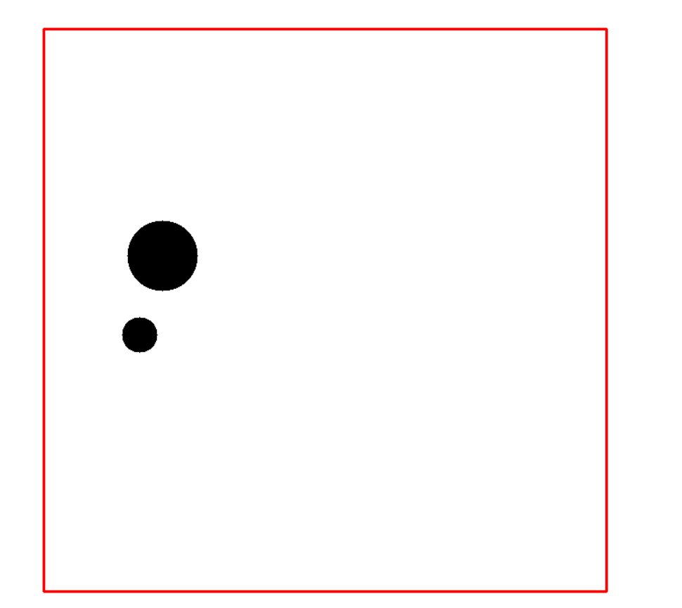

# Program_DesignII
## About collision.cpp
- Visualizing Ball Collision Behavior Simulation using OpenCV
### To execute this code:
- Run the code in a C++ development environment, such as Code::Blocks.
- Prompt the user to input the number of spheres and the dimensions of the boundary (length and width).
- Input the x and y coordinates of each individual sphere.
- Run the program to observe the physical behavior of the spheres colliding.
## demo_picture
